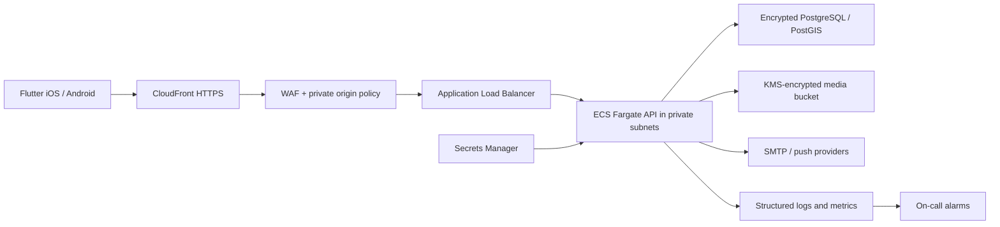

# Architecture

## System shape

ParkShield begins as a modular monolith: one deployable API with independently owned business modules. This keeps transactions and operations understandable while the product discovers stable scaling boundaries. Modules communicate through application interfaces and domain events, never through another module's tables.

The mobile client uses feature-first Clean Architecture. The backend uses presentation, application, domain, and infrastructure layers. PostgreSQL is the authoritative transactional store and encrypted object storage holds community media. Provider interfaces isolate OCR, prediction, maps, email, and push delivery so independently scaled workers can be introduced without changing domain contracts.

## Planned bounded contexts

Identity & Access; Parking Regulations; Location Intelligence; Risk Scoring; Sign Understanding; Community Trust; Recovery; Recommendations; Notifications; Billing; Administration & Audit.

## Trust and AI constraints

Every answer carries provenance (`official`, `community_verified`, `ai_prediction`, or `estimated`), confidence, observation time, geographic scope, and expiry. Deterministic regulation evaluation outranks model output. AI cannot silently overwrite official data. Safety answers expose uncertainty and an actionable fallback. Training and evaluation datasets are versioned; user-contributed media requires consent, retention rules, and PII redaction.

## Non-functional targets

- Availability: initial API SLO 99.9%; graceful degradation when AI providers fail.
- Latency: p95 under 500 ms for cached location scores; asynchronous sign analysis target under 10 s.
- Security: least privilege, RBAC, short-lived access tokens, rotating refresh tokens, encrypted transport/storage, immutable admin audit log, abuse controls, and dependency/container scanning.
- Privacy: data minimization, explicit location consent, deletion/export workflows, and bounded retention.
- Resilience: idempotent writes, transactional outbox, retries with jitter, circuit breakers, point-in-time database recovery, and tested restores.

## API policy

REST endpoints live below `/api/v1`. Schemas are explicit and backward compatible within a version. Errors will use RFC 9457 Problem Details. Write endpoints accept idempotency keys where duplicate physical events could cause harm.

## Deployment shape

CloudFront is the only allowed ALB origin. ECS tasks have no public IP, images are promoted by digest, production uses multi-AZ PostgreSQL and deletion protection, and environment state/credentials are isolated.
