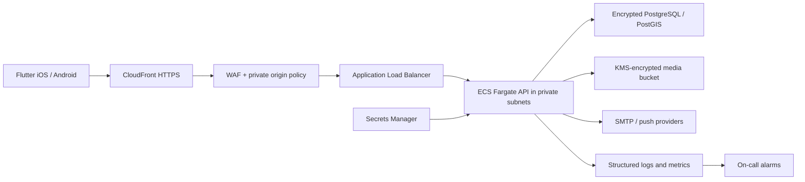

# Architecture

## System shape

ParkShield begins as a modular monolith: one deployable API with independently owned business modules. This keeps transactions and operations understandable while the product discovers stable scaling boundaries. Modules communicate through application interfaces and domain events, never through another module's tables.

The mobile client uses feature-first Clean Architecture. The backend uses presentation, application, domain, and infrastructure layers. PostgreSQL is the authoritative transactional store and encrypted object storage holds governed community media outside the database. Media access uses privileged, short-lived grants; object keys remain internal, every access or purge is audited, and retention never exceeds 30 days. Provider interfaces isolate OCR, prediction, maps, email, and push delivery so independently scaled workers can be introduced without changing domain contracts.

## Bounded contexts

Identity & Access; Parking Regulations; Municipal Data Ingestion; Location Intelligence; Risk Scoring; Sign Understanding; Community Trust; Recovery; Recommendations; Notifications; Privacy & Data Rights; Billing; Observability & Analytics; Administration & Audit.

Privacy & Data Rights owns optional-consent history, access/export requests, and account deletion. It depends on identity only through domain data and on private media through a deletion port. It never reads provider credentials, exposes storage keys, or writes another module's tables directly. The SQL adapter assembles an export from authoritative rows and the application service coordinates fail-closed deletion before the user transaction cascades owned records.

Municipal Data Ingestion owns source registration, feed contracts, normalization, import evidence, quarantine metadata, and lineage. Connectors parse supplied bytes without network access. The SQL adapter atomically upserts accepted records into the existing parking contexts while preserving the source and batch identifiers. A source can produce `official` provenance only after an MFA-authenticated administrator records it as official with a public license URL; that technical control does not replace legal or municipal verification, which remains a deployment gate.

Billing owns the provider-neutral product catalog, entitlement decisions, verified subscription state, and append-only reconciliation evidence. Clients can never grant an entitlement: an opaque store payload must be verified by the configured domain-restricted gateway before the ledger changes. Raw receipts and store transaction identifiers are not persisted; HMAC references support idempotency and reconciliation. Account deletion unlinks the user while preserving only pseudonymous records subject to the owner-approved financial retention policy. The backend never invents price or tax information; Apple or Google is the display and transaction authority.

Observability & Analytics owns low-cardinality operational signals, W3C trace propagation, integration-failure classification, and optional product-event contracts. It is composed once per application, depends only on provider ports, and cannot inspect request bodies or domain records. Product events require both a deployment flag and current user consent, use an independent HMAC subject, accept only fixed scalar properties, expire within 90 days, and support subject deletion. Operational health is not conditional on product consent.

## Trust and AI constraints

Every answer carries provenance (`official`, `community_verified`, `ai_prediction`, or `estimated`), confidence, observation time, geographic scope, and expiry. Deterministic regulation evaluation outranks model output. AI cannot silently overwrite official data. Safety answers expose uncertainty and an actionable fallback. Training and evaluation datasets are versioned; user-contributed media requires consent, retention rules, and PII redaction.

## Non-functional targets

- Availability: initial API SLO 99.9%; graceful degradation when AI providers fail.
- Latency: p95 under 500 ms for cached location scores; asynchronous sign analysis target under 10 s.
- Security: least privilege, RBAC, short-lived access tokens, rotating refresh tokens, encrypted transport/storage, immutable admin audit log, abuse controls, and dependency/container scanning.
- Privacy: data minimization, explicit location consent, deletion/export workflows, and bounded retention.
- Resilience: idempotent writes, transactional outbox, retries with jitter, circuit breakers, point-in-time database recovery, and tested restores.

## API policy

REST endpoints live below `/api/v1`. Schemas are explicit and backward compatible within a version. Errors will use RFC 9457 Problem Details. Write endpoints accept idempotency keys where duplicate physical events could cause harm.

## Deployment shape

CloudFront is the only allowed ALB origin. ECS tasks have no public IP, images are promoted by digest, production uses multi-AZ PostgreSQL and deletion protection, and environment state/credentials are isolated.
